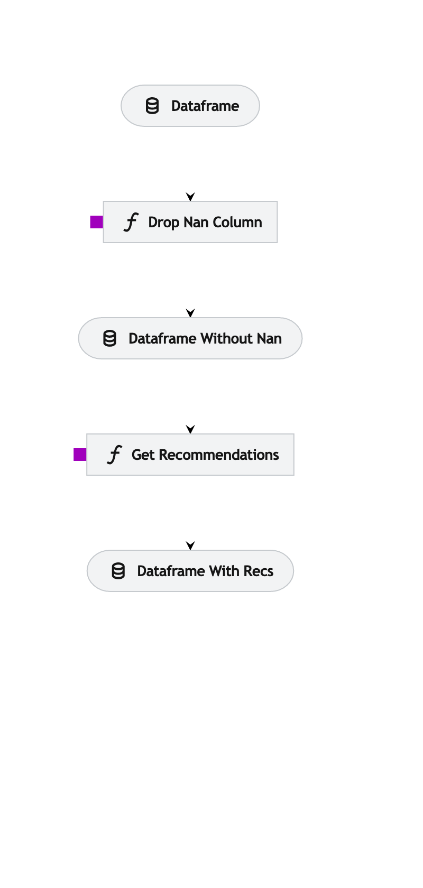

# Доступные общие пайплайны

Общие пайплайны - пайплайны для использования в CLI Kedro, а также во встроенной утилите `multirec`. Общие пайплайны состоят из меньших - [модульных пайплайнов](modular_pipelines.md).

На данный момент доступны следующие пайплайны:

- [пайплайн по умолчанию](#пайплайн-по-умолчанию).

## Пайплайн по умолчанию

Пайплайн по умолчанию удаляет строки с пропусками и строит для указанной колонки в файле формата `csv` рекомендации для каждой строки с помощью модульного пайплайна ["Построение рекомендация на основе близости контента с использованием мешка слов"](modular_pipelines.md#построение-рекомендация-на-основе-близости-контента-с-использованием-мешка-слов).

Пример запуска пайплайна по умолчанию через утилиту `multirec`:
```bash
multirec run <path_to_csv> <out_path_to_csv>
```

<!--  -->
<!-- <center>
    <figure>
        
        <figcaption>Рисунок 1. Пайплайн по умолчанию.</figcaption>
    </figure> 
</center> -->
<!-- <center></center> -->

